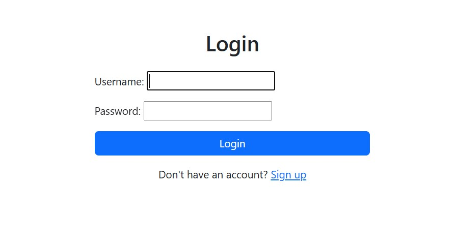
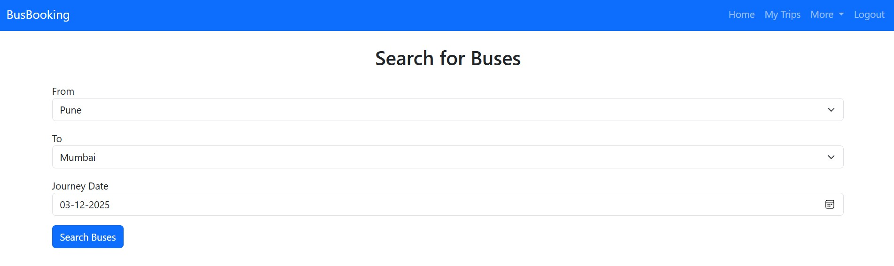
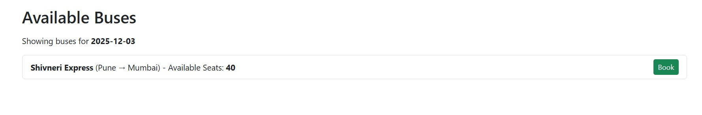
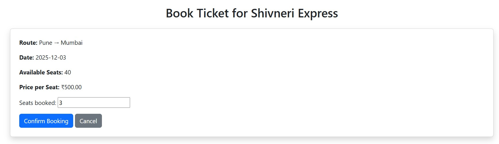
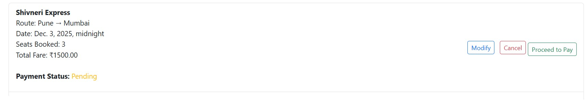
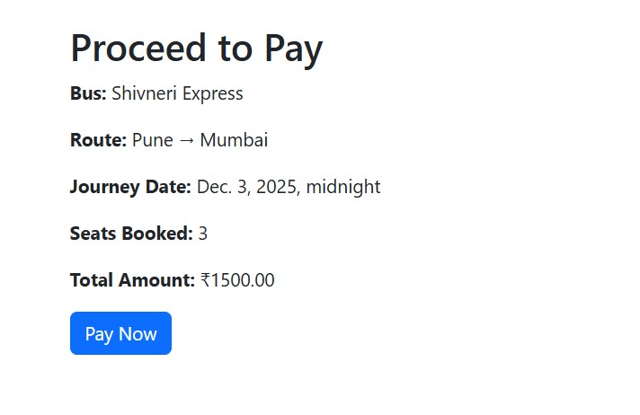

**BookMyTrip** 🚌🛣️


A Django-based travel booking website that allows users to search for buses, book seats, view trips, and manage their profiles.


🎯 **Features**

- User sign-up, login, and profile management
- Search buses by destination and date
- View available seats, book or cancel tickets
- Fare calculation based on selected seats
- Modify bookings and view booked trips
- SQLite database for development
- Basic UI with HTML


 🛠️ Tech Stack

- **Backend:** Django (Python)
- **Database:** SQLite (development)
- **Frontend:** HTML
- **Tools:** VS Code, Git, GitHub

---

_Getting Started_

1. Clone the Repo
```bash
git clone https://github.com/your-username/BookMyTrip.git
cd BookMyTrip
cd bus_booking  # Main Django project folder
2. python -m venv venv
source venv/bin/activate
3.pip install -r requirements.txt ##install dependencies
4.python manage.py makemigrations
python manage.py migrate  ##Run migrations
5.python manage.py runserver
http://127.0.0.1:8000/ access via this link

To Do list:
>> add payment gateway
>> apply css to enhance UI
>> add user email varification
>>deploy to cloud

Screenshots:
1.Login/Signup page

2. Search Buses

3. Available buses

4. Confirm booking

5. My Bookings

6. Payment process



